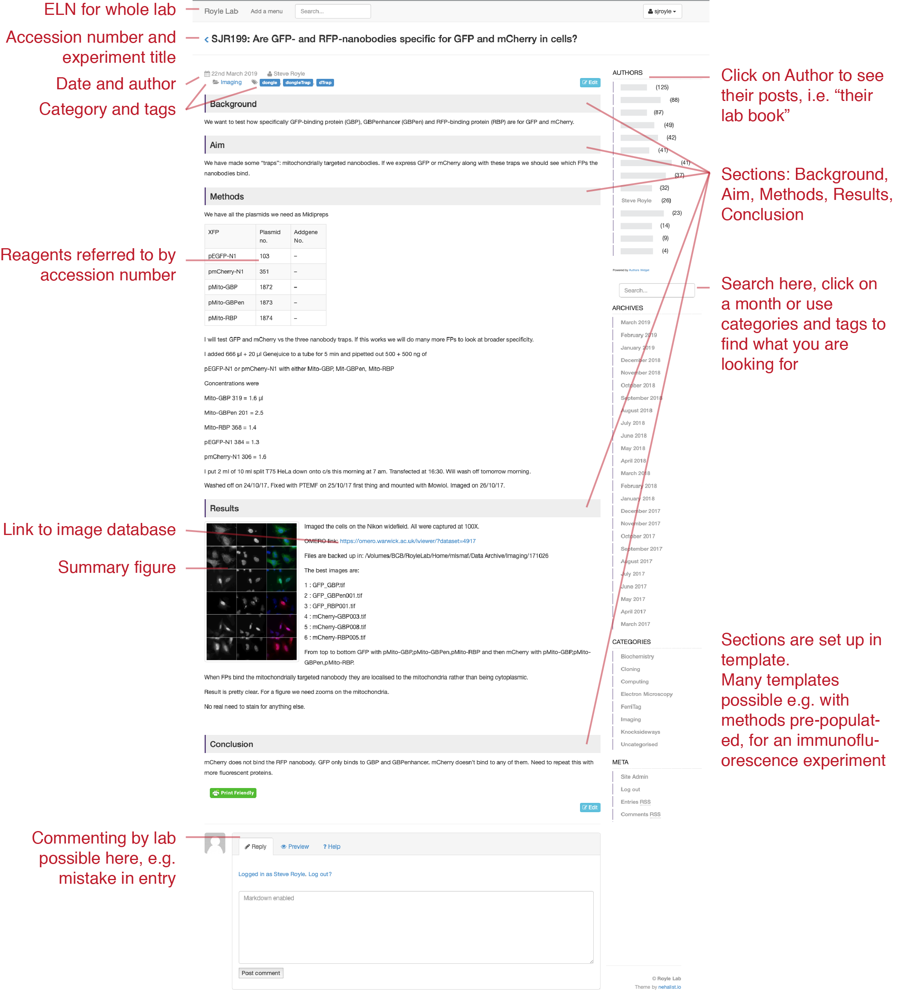

ELNgitsta
======

> **gitsta theme is no longer maintained. See [here](https://nehalist.io/not-maintaining-my-wordpress-theme-gitsta-anymore/).**

This is a fork of gitsta that has been repurposed for use in Electronic Lab Notebooks (ELNs). In the Centre for Mechanochemical Cell Biology at Warwick we run a multi-site WordPress install to power ELNs for several research labs. This theme is served up for the ELNs of all labs.

> Now updated to use Gutenberg blocks

For more information on our use of ELNs see the links [below](#links)

### Links
* [Deciding on an ELN platform](https://quantixed.org/2017/04/25/the-soft-bulletin-electronic-lab-notebooks/)
* [Our use of WordPress at gitsta theme + simple install](http://quantixed.org/2017/04/27/notes-to-the-future/)
* [CAMDU blog on our multi-site setup](https://blogs.warwick.ac.uk/camdu/entry/multi-site_electronic_lab/)
* [Dave Mason's install instructions](https://postacquisition.wordpress.com/2017/10/17/more-notes-to-the-future/)

